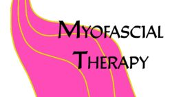
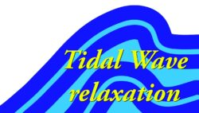
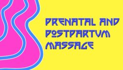
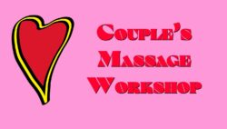

### Myofascial Release Therapy

Myofascial Therapy, or MFT, is my pain relief service. Within this style, I combine a number of massage styles to create a massage session as unique as you. We will work together to reduce pain and improve range of motion of affected areas.  
This session type can be intense, as I will often “sit” directly on painful areas to encourage fascial unwinding, which effects release of the intended tissues.  
From $80  
00  
30m

- 
    Pain Relief
- 
    Improve Posture
- 
    Improved State of Mind

[  
Book Your Myofascial Therapy Session Now](https://paulbrown.noterro.com/service/26506/myofascial-therapy)  
This is text element  
Pain Relief!

### Tidal Wave Relaxation

When you really need to relax, it’s time for a Tidal Wave of relaxation to sweep over your body! This session combines full-body-length effleurage alongside rhythmic regional work to propel you into a deeply relaxed state of mind and body. Because of the nature of this work, I have developed a special draping technique to ensure bodily modesty while still offering the exposure necessary to perform this technique.  
$  
120  
00  
Hour

- 
    Very rhythmic1
- 
    Full body length strokes
- 
    Lulls you into Profound bliss and relaxation
- 
    60, 90, or 120 minute session lengths

[  
Book Your Tidal Wave Relaxation Session Now!](#)  
Relaxing!

#### Prenatal and Postpartum Massage

The pregnant need massage more than anybody, as their bodies undergo profound changes over the course of gestation. As a pregnancy progresses, the areas of focus and positioning requirements change as well. You’ll receive very respectful care, and I strive to ensure your comfort and sense of safety during these sessions.  
NOTE: at-risk pregnancy requires written permission from your physician before service may commence.  
$  
125  
00  
Hour

- 
    List Item #1
- 
    List Item #2
- 
    List Item #3

[  
Click Here](#)  
This is text element  
For Moms-to-be

### Sports Massage

From the weekend warrior all the way to elite professional and Olympic athletes, you need high quality bodywork focused on improving freedom of movement so you can perform at your best! And then when the event/game/training is over, you’ll need the post-event work to help you recover more rapidly.  
$  
127  
50  
Hour

- 
    List Item #1
- 
    List Item #2
- 
    List Item #3

[  
Click Here](#)  
This is text element  
Popular

### Couples Massage Workshop

Popular around Valentine’s Day, Wedding anniversaries, birthdays, or whenever, my popular Couples Massage Workshop is a great way to learn with your loved one! I’m often asked, “don’t your hands hurt?” when people find out I’m a massage therapist, so much so that I figured there’s a real need for people to learn how to safely and effectively massage their loved ones. Thus the Couples Massage Workshop was born! In this two hour private class, you and your loved one will learn the basics of giving a back of the body Swedish massage, using two of the five stroke techniques. Each participant receives forty-five minutes of individual instruction, which is enough time to massage the entire back of the body! You’ll learn a useful skill and end up feeling great!  
$  
179  
00  
2-hour session

- 
    List Item #1
- 
    List Item #2
- 
    List Item #3

[  
Click Here](#)  
This is text element  
Learn with  
your loved one!

[Book Now!](https://paulbrown.noterro.com)

[Book Now!](https://paulbrown.noterro.com)

